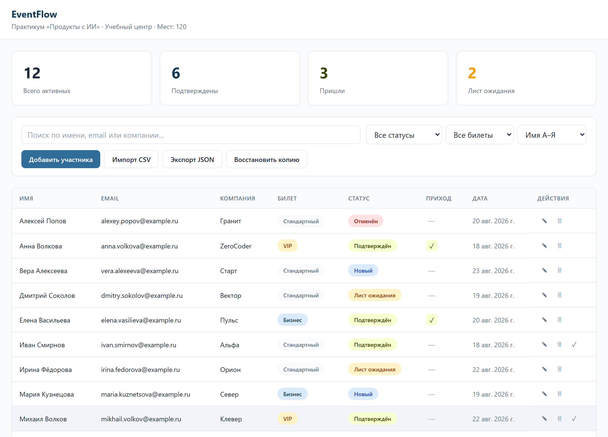
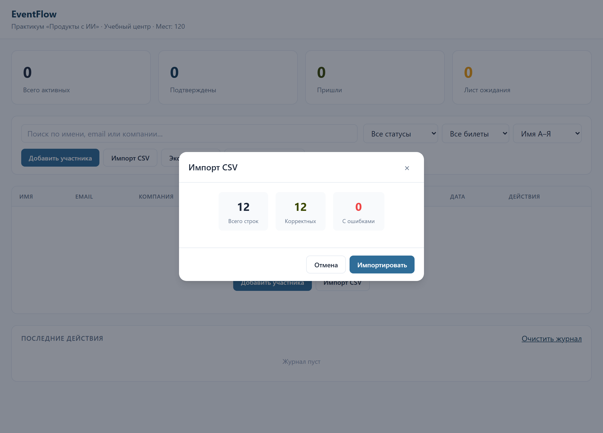
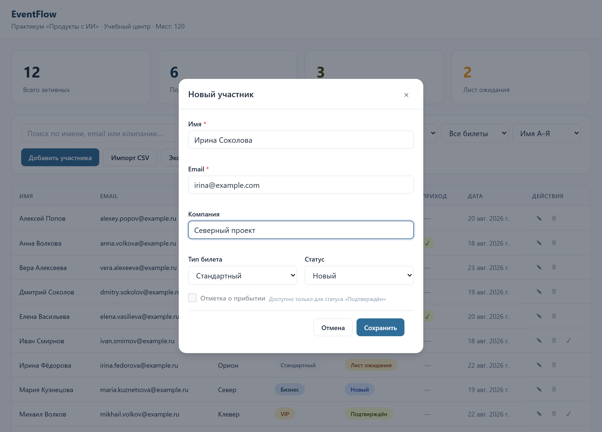

# EventFlow — управление участниками мероприятия

Локальное веб-приложение для организатора мероприятия: список участников, подтверждения, лист ожидания и отметка о приходе — в одном окне, без сервера, без регистрации и без передачи данных во внешние сервисы.

**Живая демонстрация:** https://yaroslava-111.github.io/eventflow/app/

Этот файл написан для человека, который впервые видит репозиторий: как установить проект с нуля, запустить, проверить, сделать резервную копию, обновить и что делать, если что-то не работает.

---

## 1. Что делает сервис и для кого он создан

Заявки на мероприятие приходят отовсюду: из формы на сайте, из личных сообщений, по почте, от коллег «добавь ещё троих». Организатор ведёт их в таблице, теряет статусы, не понимает, сколько человек реально придёт, и в день мероприятия отмечает пришедших ручкой по распечатке.

EventFlow собирает этот поток в один экран: сколько всего участников, сколько подтвердилось, сколько уже пришло и сколько ждёт места. Список редактируется прямо на странице, а на входе участника отмечают одной кнопкой.

Для кого:

- **организатор конференции, вебинара, мастер-класса или хакатона** — ведёт список и контролирует явку;
- **администратор учебного центра** — следит за наполняемостью группы и листом ожидания;
- **координатор на входе** — отмечает пришедших в день мероприятия.

### Возможности

- **Показатели в реальном времени** — всего активных, подтверждены, пришли, лист ожидания.
- **Таблица участников** — добавление, редактирование, архивирование, отметка о приходе.
- **Поиск и фильтры** — по имени, email и компании, по статусу и типу билета, с сортировкой.
- **Импорт CSV** — загрузка списка с предпросмотром и проверкой: сколько строк корректны, сколько с ошибками, и только потом импорт.
- **Экспорт в JSON и восстановление из файла** — полноценная резервная копия в один клик.
- **Журнал действий** — история всех операций с цветовой пометкой.
- **Отмена архивации** — уведомление с кнопкой «Отменить» сразу после действия.
- **Работа без интернета** — после открытия страницы соединение не требуется.

---

## 2. Интерфейс

Основной экран: показатели, фильтры и таблица участников со статусами и типами билетов.



Импорт CSV: перед загрузкой показано, сколько строк корректных и сколько с ошибками.



Добавление участника: имя, email, компания, тип билета и статус.



---

## 3. Системные требования

| Что нужно | Версия | Зачем |
|---|---|---|
| Браузер Chrome, Edge, Firefox или Safari | Chrome/Edge 90+, Firefox 90+, Safari 15+ | Сам сервис |
| Git | любая актуальная | Склонировать репозиторий |
| Python | 3.8 и новее | Локальный сервер — он здесь обязателен |

Операционная система — любая: Windows, macOS, Linux. Node.js, база данных на сервере и сборка не нужны.

**Важное отличие от обычной статической страницы:** EventFlow хранит данные в браузерной базе IndexedDB, а браузеры запрещают её при открытии файла по адресу `file://`. Поэтому приложение запускается **только через локальный сервер или по сетевому адресу** — двойным щелчком по `index.html` оно корректно работать не будет.

---

## 4. Установка с чистого компьютера

### 4.1. Установите Git

- **Windows:** скачайте установщик с https://git-scm.com/download/win и пройдите его с настройками по умолчанию.
- **macOS:**

  ```bash
  xcode-select --install
  ```

- **Linux (Ubuntu/Debian):**

  ```bash
  sudo apt update && sudo apt install -y git
  ```

Проверьте установку:

```bash
git --version
```

### 4.2. Установите Python

Python нужен только как локальный веб-сервер.

- **Windows:** скачайте установщик с https://www.python.org/downloads/ и **обязательно** отметьте галочку «Add Python to PATH» на первом экране.
- **macOS:** Python 3 уже установлен; при необходимости поставьте свежую версию с того же сайта.
- **Linux (Ubuntu/Debian):**

  ```bash
  sudo apt update && sudo apt install -y python3
  ```

Проверьте установку:

```bash
python --version
```

Если команда не найдена, попробуйте:

```bash
python3 --version
```

### 4.3. Склонируйте репозиторий

```bash
git clone https://github.com/Yaroslava-111/eventflow.git
cd eventflow
```

### 4.4. Установите зависимости

Зависимостей нет: ни библиотек, ни сборки. Виртуальное окружение Python создавать **не нужно** — Python используется только как готовый веб-сервер из стандартной поставки, свои пакеты проект не устанавливает.

---

## 5. Запуск

Из корневой папки проекта выполните:

```bash
python -m http.server 8000
```

Если команда `python` не найдена:

```bash
python3 -m http.server 8000
```

Откройте в браузере:

```text
http://localhost:8000/app/
```

Обратите внимание на `/app/` в конце адреса — интерфейс лежит в этой папке.

Чтобы остановить сервер, вернитесь в терминал и нажмите `Ctrl + C`.

---

## 6. Проверка работоспособности

Автотестов в проекте нет — проверка выполняется вручную за пять минут на готовых демонстрационных файлах из папки `data/`.

### 6.1. Главный пользовательский сценарий

1. Откройте `http://localhost:8000/app/`.
   **Ожидаемый результат:** все четыре показателя равны нулю, таблица пустая.
2. Нажмите **«Импорт CSV»** и выберите файл `data/participants.csv`.
   **Ожидаемый результат:** в окне предпросмотра — 12 строк, 12 корректных, 0 с ошибками.
3. Нажмите **«Импортировать»**.
   **Ожидаемый результат:** в таблице 12 участников, показатели пересчитались, внизу в журнале появилась запись об импорте.
4. Нажмите **«Импорт CSV»** ещё раз и выберите `data/participants-with-errors.csv`.
   **Ожидаемый результат:** в предпросмотре часть строк отмечена как ошибочные — значит, проверка данных работает. Нажмите «Отмена».
5. В поле поиска введите `Волков`.
   **Ожидаемый результат:** в таблице остались только участники с этой фамилией.
6. Очистите поиск, в столбце **«Приход»** отметьте любого подтверждённого участника.
   **Ожидаемый результат:** показатель **«Пришли»** увеличился на единицу.
7. Нажмите **«Добавить участника»**, заполните имя и email, сохраните.
   **Ожидаемый результат:** участник появился в таблице, показатель «Всего активных» вырос.
8. Нажмите **«Экспорт JSON»**.
   **Ожидаемый результат:** скачался файл вида `eventflow-backup-2026-10-05.json`.
9. Обновите страницу клавишей `F5`.
   **Ожидаемый результат:** все данные на месте — значит, сохранение в браузерной базе работает.

Если все девять шагов прошли как описано, сервис исправен.

---

## 7. Переменные окружения

Переменных окружения в проекте **нет**, файла `.env` тоже нет. Приложение не обращается к внешним сервисам, ключи и пароли ему не нужны.

Настройки самого мероприятия — название, площадка, вместимость, список статусов и типов билетов — задаются в файле `data/event-settings.json`. Он служит образцом: фактические значения продублированы в начале файла `app/app.js`, поэтому менять нужно **оба** файла, чтобы они не разошлись.

---

## 8. Структура проекта

```text
eventflow/
├── app/
│   ├── index.html      # Разметка интерфейса
│   ├── styles.css      # Стили и адаптивность
│   ├── db.js           # Работа с IndexedDB: схема, чтение, запись, транзакции
│   └── app.js          # Логика интерфейса: фильтры, импорт, экспорт, журнал
├── data/
│   ├── event-settings.json           # Настройки мероприятия, статусы, типы билетов
│   ├── participants.csv              # Демонстрационный список из 12 участников
│   └── participants-with-errors.csv  # Файл с ошибками для проверки импорта
├── screenshots/        # Скриншоты для этого файла
└── README.md
```

---

## 9. Публикация

Проект — статический сайт, публикуется бесплатно на GitHub Pages.

Публикация уже включена, адрес: https://yaroslava-111.github.io/eventflow/app/

Как включить её в своей копии репозитория:

1. Репозиторий на GitHub → **Settings** → **Pages**.
2. **Build and deployment** → источник **Deploy from a branch**.
3. Ветка `main`, папка `/ (root)` → **Save**.
4. Через одну–две минуты приложение доступно по адресу `https://<ваш-логин>.github.io/eventflow/app/`.

Подойдёт и любой другой статический хостинг — Netlify, Vercel, обычный веб-сервер. Требование одно: страница должна открываться по `http://` или `https://`, а не из файла.

Важно понимать, что публикация не создаёт общей базы участников: у каждого посетителя сайта своё хранилище в его собственном браузере. Данные между устройствами переносятся файлом резервной копии (раздел 11).

---

## 10. Обновление

В папке проекта:

```bash
git pull
```

Затем обновите страницу сочетанием `Ctrl + F5` (на macOS — `Cmd + Shift + R`).

Опубликованный на GitHub Pages сайт обновляется сам в течение одной–двух минут после отправки изменений в ветку `main`.

Данные при обновлении **не теряются**: они лежат в браузере, а не в файлах проекта. Тем не менее перед обновлением сделайте резервную копию кнопкой **«Экспорт JSON»** — это занимает секунду и страхует от неожиданностей.

---

## 11. Резервное копирование и восстановление

Все данные хранятся в браузере, в базе IndexedDB с именем `eventflow-db`. В файлах проекта и на сервере их нет.

### Сделать резервную копию

1. Нажмите кнопку **«Экспорт JSON»**.
2. Браузер скачает файл вида `eventflow-backup-2026-10-05.json`.
3. Сохраните файл в надёжное место — этого достаточно для полного восстановления.

Делайте копию **в конце каждого рабочего дня** и обязательно **перед мероприятием**.

### Восстановить из копии

1. Нажмите кнопку **«Восстановить копию»**.
2. Выберите ранее сохранённый файл `eventflow-backup-*.json`.
3. Приложение проверит версию файла и загрузит участников.

Тот же файл переносит список на другой компьютер или в другой браузер: экспортируйте на одном, восстановите на другом.

### Если нужно начать с чистого листа

Откройте `F12` → вкладка **Application** → **Storage** → **IndexedDB** → `eventflow-db` → **Delete database**, затем обновите страницу. Это действие необратимо — сначала сделайте экспорт.

---

## 12. Известные ограничения

- **Нет общей базы и совместной работы.** Хранилище принадлежит одному браузеру на одном компьютере. Двое координаторов не увидят изменения друг друга; обмен возможен только файлом резервной копии.
- **Очистка данных браузера удаляет всё.** Режим инкогнито, чистка кеша «с данными сайтов» или смена браузера означают пустой список.
- **Не работает при открытии файла напрямую** (`file://`) — нужен локальный сервер или публикация.
- **Импорт только из CSV** в ожидаемом формате колонок; XLSX и Google Таблицы напрямую не поддерживаются.
- **Нет рассылок и уведомлений участникам** — ни писем, ни сообщений.
- **Нет печати бейджей, QR-кодов и сканирования на входе** — отметка о приходе ставится вручную.
- **Нет авторизации и разграничения прав** — кто открыл страницу, тот видит и правит всё.
- **Одно мероприятие за раз.** Параллельно вести два списка в одном браузере нельзя.

---

## 13. Если что-то не работает

| Что вы видите | Причина | Что сделать |
|---|---|---|
| Пустой экран или ошибка при открытии `index.html` двойным щелчком | Браузер запрещает IndexedDB для `file://` | Запустите локальный сервер и откройте `http://localhost:8000/app/` |
| Страница открылась, но данные не сохраняются | Открыт режим инкогнито или запрещены данные сайтов | Откройте в обычном окне; разрешите сайту сохранять данные в настройках браузера |
| 404 при открытии `http://localhost:8000` | Сервер запущен из корня, а интерфейс лежит в `app/` | Откройте `http://localhost:8000/app/` |
| Импорт CSV помечает все строки ошибочными | Не совпадают названия колонок или кодировка файла | Сравните свой файл с `data/participants.csv`; сохраните CSV в кодировке UTF-8 |
| После восстановления копии данные не появились | Файл от другой версии приложения | Проверьте, что выбран файл `eventflow-backup-*.json`, созданный кнопкой «Экспорт JSON» |
| Показатели не сходятся с таблицей | Включены фильтры: показатели считаются по всей базе, таблица показывает отфильтрованное | Нажмите «Сбросить фильтры» |
| `python: command not found` | Python не установлен или называется `python3` | Выполните `python3 -m http.server 8000` или установите Python с https://www.python.org/downloads/ |
| `Address already in use` | Порт 8000 занят | Запустите на другом порту: `python -m http.server 8080` |

### Где смотреть журнал ошибок

Своих файлов журнала у приложения нет. Два места для диагностики:

- **Журнал действий** внизу страницы — история операций самого приложения: импорт, изменения, архивация.
- `F12` → вкладка **Console** — технические ошибки. Там же, на вкладке **Application** → **IndexedDB** → `eventflow-db`, видно фактическое содержимое базы.

---

## 14. Поддержка

Вопросы, замечания и сообщения об ошибках — через раздел **Issues** этого репозитория: https://github.com/Yaroslava-111/eventflow/issues

Автор проекта: https://github.com/Yaroslava-111
