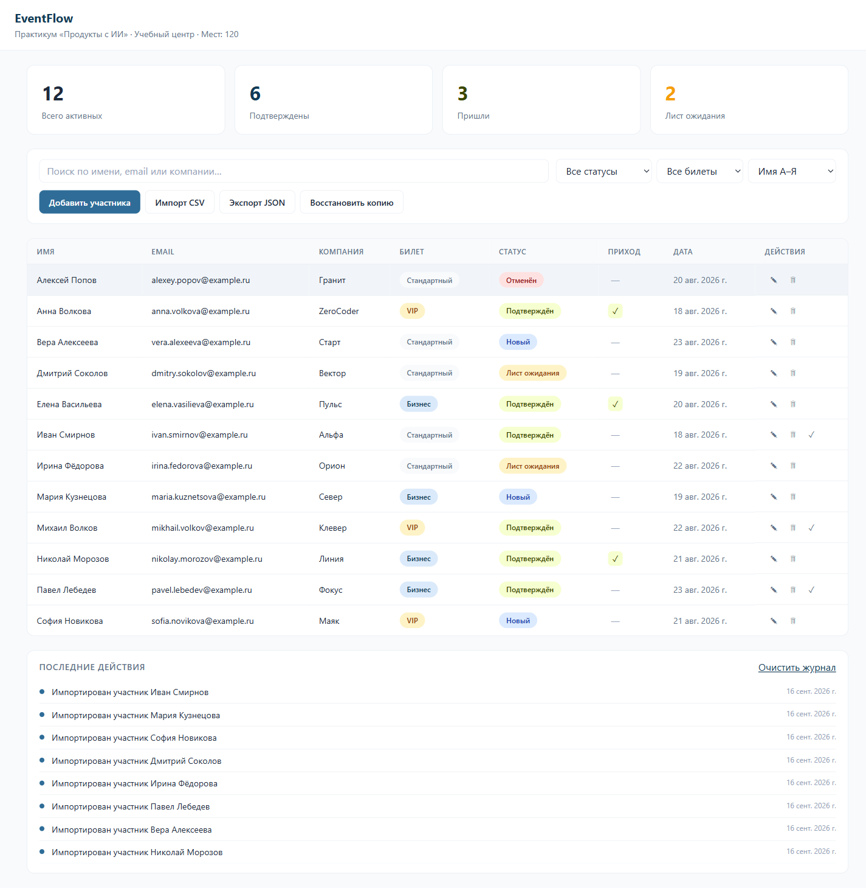
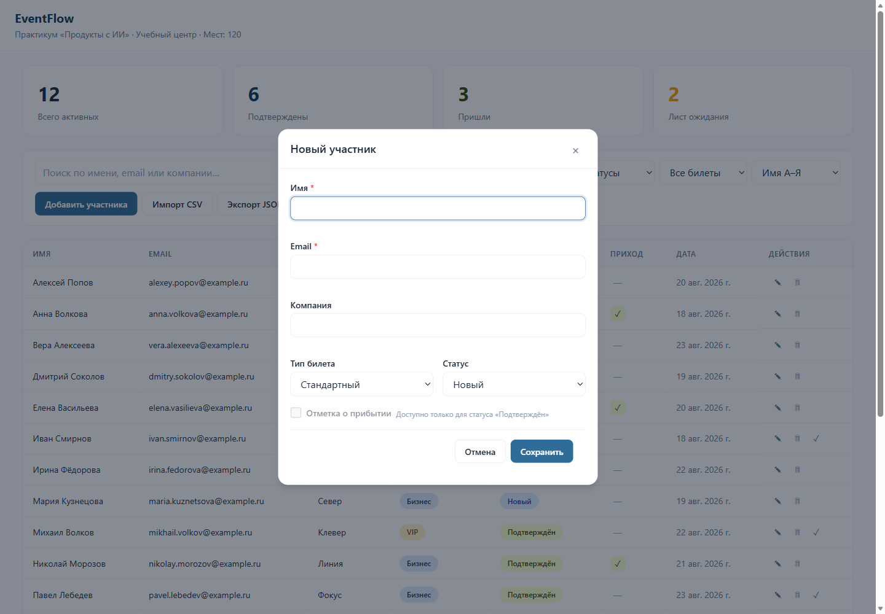

# EventFlow

Локальное веб-приложение для управления участниками мероприятий — от конференций и вебинаров до хакатонов и мастер-классов.

## Задача

Организаторам мероприятий сложно держать под контролем поток участников: заявки приходят из разных мест, статусы меняются, нужно отсливать присутствие и работать со списком ожидания. EventFlow решает эту проблему — всё в одном окне, без сервера и регистрации.

## Результат

Полнофункциональный дашборд с:

- **Метриками** — количество участников, подтверждённых, пришедших и в листе ожидания обновляются в реальном времени
- **Таблицей участников** — добавление, редактирование, архивирование, отметка о прибытии (check-in)
- **Фильтрами и поиском** — по статусу, типу билета, имени, email и компании с мгновенной фильтрацией
- **Импортом CSV** — загрузка списка участников с предпросмотром и валидацией перед импортом
- **Экспортом и восстановлением** — бэкап в JSON и обратная загрузка с проверкой версии
- **Журналом действий** — полная история всех операций с цветовой индикацией
- **Тост-уведомлениями** — с кнопкой отмены при архивации

Приложение полностью офлайн, работает в любом современном браузере.

## Скриншоты



*Дашборд с метриками, фильтрами и таблицей участников.*



*Форма добавления участника.*

## Стек

| Технология | Роль |
|---|---|
| HTML5 | Семантическая разметка |
| CSS3 | Стили, адаптивность, анимации |
| JavaScript (ES6+) | Логика приложения |
| IndexedDB | Хранение данных в браузере |

Без фреймворков, сборщиков и внешних зависимостей.

## Как запустить

Приложение — статический сайт. Нужен любой HTTP-сервер (из-за ограничений браузеров на IndexedDB с `file://`).

```bash
# Из папки app/
npx serve .
# или
python -m http.server 8000
```

Откройте `index.html` в браузере.

## Структура проекта

```
app/
├── index.html      # Разметка
├── styles.css      # Стили
├── db.js           # IndexedDB: схема, CRUD, транзакции
└── app.js          # Логика UI и обработчики

data/
├── participants.csv              # Тестовые данные (12 участников)
└── participants-with-errors.csv  # Данные с ошибками для проверки импорта
```
